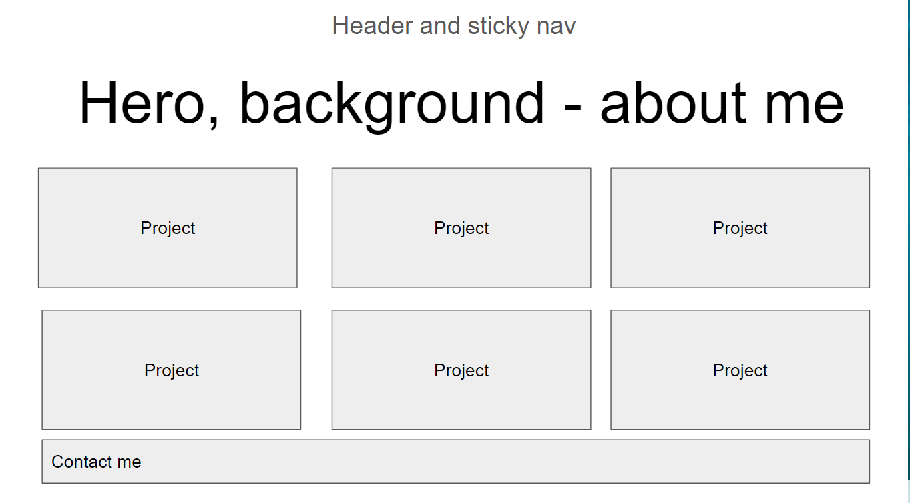

# ode-to-than - Portfolio Project

## Purpose
Establishing a website to showcase work using:
- HTML
- CSS
- Media Queries

## Installation
1. Establish basic website framework using google slides:

2. Create new repo on Github.
3. Clone repo into git terminal.
4. Created html and css files.
5. Create Sections on html and link css file
6. Style css and add media queries for all screen sizes

## Website

## Contribution
Created by Than Nguyen